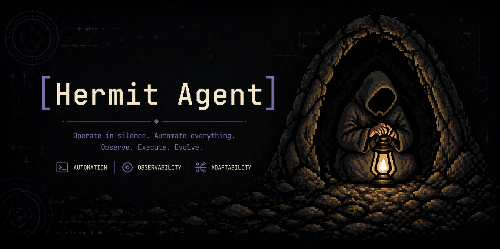
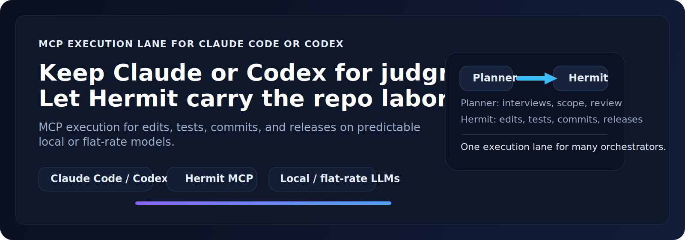

<p align="center">
  
</p>

# HermitAgent

<p align="center">
  <a href="https://github.com/cafitac/hermit-agent/releases"></a>
  <a href="https://github.com/cafitac/hermit-agent/actions/workflows/python-tests.yml"></a>
  <a href="https://www.npmjs.com/package/@cafitac/hermit-agent"></a>
  <a href="https://pypi.org/project/cafitac-hermit-agent/"></a>
  <a href="https://www.npmjs.com/package/@cafitac/hermit-agent"></a>
  <a href="LICENSE"></a>
</p>

> Hidden expert. Quiet executor.
>
> Hermit is an MCP executor for Claude Code and Codex. Your main agent handles planning, review, and conversation; Hermit quietly handles edits, test runs, refactors, commits, and other mechanical execution on a cheaper local or flat-rate model.

## How it works



Claude Code or Codex stays in charge of planning, interviewing, and review. Hermit takes the mechanical path: file edits, test runs, refactors, commits, and MCP-executed follow-through on predictable local or flat-rate execution models. The switch is one word in a slash command: `/foo` → `/foo-hermit`.

Why Hermit stands out:
- Keep your best reasoning model on the work that needs judgment, not boilerplate execution.
- Use MCP to turn planner decisions into concrete repo changes, tests, commits, and release operations.
- Default to predictable local / flat-rate executor routing instead of silently drifting onto a paid hosted fallback.
- Work with both Claude Code and Codex instead of forcing a single orchestrator stack.

## Why not just use Claude Code or Codex directly?

| Workflow shape | Claude Code / Codex alone | With Hermit |
|---|---|---|
| Planning and review | Strong | Still strong — keep the premium orchestrator where judgment matters |
| Repetitive repo work | Expensive or token-heavy | Offloaded to a cheaper MCP executor lane |
| Multi-step follow-through | Manual context handoff | MCP tasks can carry edits, tests, commits, and release ops through |
| Default execution cost | Can drift onto paid hosted models | Defaults to local / flat-rate executor routing |
| Team adoption | Tied to one orchestrator workflow | Works as a shared executor layer across Claude Code and Codex |

Hermit is not trying to replace your orchestrator. It gives you a second lane: use the premium model for judgment, and use Hermit for the mechanical throughput that makes repositories expensive to operate at scale.

## Who Hermit is for

- Teams that already like Claude Code or Codex for planning, review, and decision-making, but want a cheaper execution lane for repo mechanics.
- Developers who want MCP-driven follow-through on edits, tests, commits, and release chores without spending premium-model tokens on every step.
- Repositories that need predictable default routing toward local or flat-rate models instead of surprising hosted fallback costs.
- Maintainers who want one shared executor layer even if different contributors prefer different orchestrators.

## Who Hermit is not for

- People looking for a brand-new premium planner to replace Claude Code or Codex entirely.
- Teams that want a single hosted model to do both judgment and execution with no planner/executor split.
- Workflows where provider cost predictability, MCP task handoff, and execution-lane separation are not important.

If your pain is not "my orchestrator is smart enough, but too much of its time is spent on repetitive repo labor," Hermit is probably not the right abstraction.

## Install

```bash
npm install -g @cafitac/hermit-agent
hermit
```

Requires Node.js 20+ and Python 3.11+. The npm package bootstraps a managed Python runtime under `~/.hermit/` on first run — no repo checkout needed. If Claude Code or Codex integration is still missing, `hermit` will offer guided setup automatically. You can still run `hermit install` directly when you want to force the full setup/repair flow.

To upgrade: `hermit update`

## Quick start

```bash
hermit-mcp-server   # starts the gateway + MCP stdio server
```

Then in Claude Code:

```
/feature-develop-hermit <task>
```

Claude interviews, writes the plan, and delegates implementation to Hermit over MCP. Executor tokens never hit your orchestrator bill.

## Reference skills

Four example skills ship under `.claude/commands/`. Fork these into your own workflow:

| Command | Claude does | Hermit does |
|---|---|---|
| `/feature-develop-hermit` | interview + plan | implement + test |
| `/code-apply-hermit` | read PR review | apply every change |
| `/code-polish-hermit` | pick what to polish | lint/test loop |
| `/code-push-hermit` | write PR description | commit + push |

See [docs/hermit-variants.md](docs/hermit-variants.md) to add your own.

## Executor LLM

**ollama (local, free):**
```bash
brew install ollama && ollama pull qwen3-coder:30b
```

**z.ai (flat-rate subscription)** — add to `~/.hermit/settings.json`:
```json
{
  "providers": {
    "z.ai": {
      "base_url": "https://api.z.ai/api/coding/paas/v4",
      "api_key": "<your key>",
      "anthropic_base_url": "https://api.z.ai/api/anthropic"
    }
  }
}
```

## Configuration

`~/.hermit/settings.json` (created by `hermit install`):

```json
{
  "gateway_url": "http://localhost:8765",
  "gateway_api_key": "hermit-mcp-…",
  "model": "__auto__",
  "routing": {
    "priority_models": [
      {"model": "glm-5.1"},
      {"model": "qwen3-coder:30b"}
    ]
  }
}
```

`model` controls the default model for plain `hermit`. Set it to `__auto__` if you want plain `hermit` to follow the `routing.priority_models` order. `routing.priority_models` is the ordered fallback chain for auto-routing in gateway / interactive flows, and providers that are not configured or installed are skipped automatically. If `model` is a concrete name like `gpt-5.4`, plain `hermit` stays pinned to that model even if you reorder `priority_models`.

By default, `hermit install` now keeps Codex out of `routing.priority_models` and treats it as an explicit opt-in executor path instead of an automatic fallback. This is intentional: local / flat-rate executor models stay the safe default, while Codex remains available when a user explicitly pins it or adds it back to routing. That separation makes billing behavior more predictable, keeps executor defaults aligned with Hermit's "cheap mechanical work" role, and avoids surprising auto-routing onto a paid hosted model.

## Architecture

- **AgentLoop** — LLM turn → tool call → result → compact on context fill
- **Gateway** — FastAPI relay in front of the executor (routing, 429 failover, dashboard at `:8765`)
- **MCP server** — `run_task` / `reply_task` / `check_task` / `cancel_task`
- **TUI** — optional React+Ink terminal UI for standalone interactive sessions (`hermit`)

## Tests

```bash
.venv/bin/pytest tests/
```

## Status

Early, working, MIT. No release cadence guarantees.

## License

MIT — see [LICENSE](LICENSE).

## See also

- [docs/cc-setup.md](docs/cc-setup.md) — Claude Code MCP registration details
- [docs/hermit-variants.md](docs/hermit-variants.md) — the `-hermit` skill family
- [docs/measure-savings.md](docs/measure-savings.md) — cost-savings measurement protocol
- [docs/open-source-positioning.md](docs/open-source-positioning.md) — short public-facing copy for descriptions, releases, and future social previews
- [docs/release-notes-template.md](docs/release-notes-template.md) — reusable release-note framing that matches Hermit's planner/executor positioning
- [docs/social-preview-ops.md](docs/social-preview-ops.md) — how to review, export, and upload the GitHub social-preview image
- [docs/assets/hermit-readme-hero.svg](docs/assets/hermit-readme-hero.svg) — README hero graphic for the planner/executor split
- [docs/assets/hermit-social-preview.svg](docs/assets/hermit-social-preview.svg) — final editable social-preview asset for repo cards and launch posts
- [docs/assets/hermit-social-preview.png](docs/assets/hermit-social-preview.png) — ready-to-upload GitHub social-preview export
- [docs/assets/hermit-social-preview-review.html](docs/assets/hermit-social-preview-review.html) — local review page for checking the social-preview composition before export
- [CHANGELOG.md](CHANGELOG.md) — notable release and policy changes
- [benchmarks/](benchmarks/) — reproducible task specs and community datapoints
